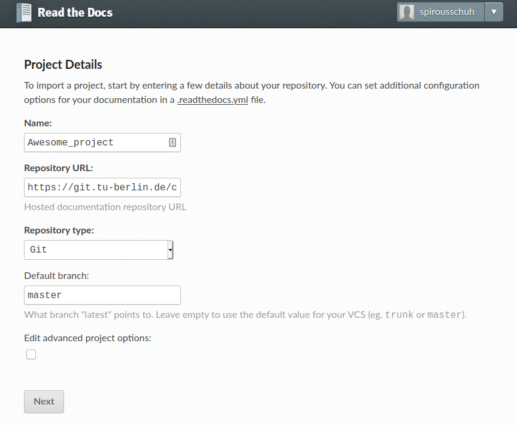
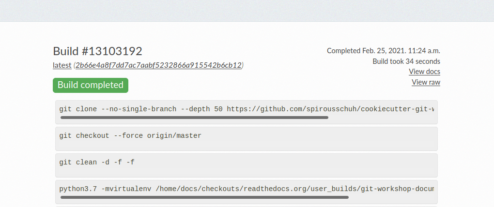

.. _read-the-docs:

Read the Docs
=============

What does Read the Docs do?

* a service that hosts sphinx documentation
* all public repositories are free
* a framework for starting your own documentation server

So here you can find step by step instructions how to publish your documentation
using Read the Docs.

Setup Read the Docs
+++++++++++++++++++

#. Go to https://readthedocs.org/ and create an account.
#. Log in and click on your user-name in the upper right corner.
#. Click on Import a Project
#. Something Manual
#. Then fill the following form

6. Click on **next**.

Now you successfully introduced Read the Docs to your repository. On the next
page you see two important things.

On the one hand you can try to build your documentation and on the other hand we
did not establish a webhook so far. Let us start with the build.

Build Documentation
+++++++++++++++++++

For the build your repository needs to be public. In case it is already public
please continue here.

#. Open your repository ``https://git.tu-berlin.de/your/repo/url``
   in the browser
#. In the bottom left corner click on settings
#. Scroll down to the section *Visibility, project features, permissions*
#. Click on the **Expand** button
#. Underneath the heading *Project Visibility* use the drop down menue to choose
   *Public*
#. Scroll down and click save changes

Now your repository can be seen by everybody in the internet, in particular by
the Read the Docs service, so we can start building the documentation.

#. Open https://readthedocs.org/ in your browser and log in
#. Click on your user-name in the upper right corner.
#. Click on your project name
#. Click on the **Build Version** button
#. Wait for the build to succeed. It should look like this

#. On the right hand side please click on the button **View docs**.

Add Webhook
+++++++++++

Now we want our documentation to be updated automatically, once a Merge Request
is merged. Therefore we will add a webhook to the repository.

#. Open https://readthedocs.org/ in your browser and log in
#. Click on your user-name in the upper right corner.
#. Click on your project name
#. Click on the **Admin** button
#. In the navigation on the left hand side click on **Integrations**
#. Click on the button **Add integration**
#. In the pull down menue select *GitLab incoming webhook* and click on the
   **Add integration** button
#. Now right click on the link that you see and that starts with
   ``readthedocs.org/api/v2/webhook/...`` to copy it
#. Go back to your repository ``https://git.tu-berlin.de/your/repo/url``
#. Click on **Settings>Webhooks**
#. Copy the webhook URL to the *URL* field
#. Scroll down and click on *Add webhook*.